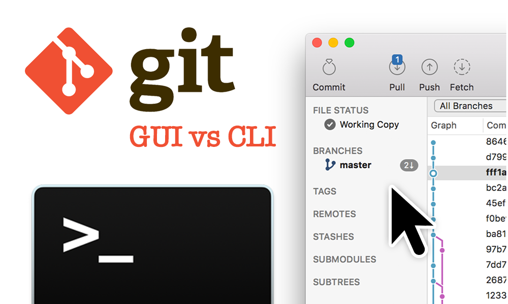

# Git & hub 101
## by Olgierd &#34;Allgreed&#34; Kasprowicz


## Why git?
### Svn works fine, right?

- Bazaar
- Perforce
- Mercurial
- CVS
- SVN (Apache Subversion)


## Compatibility
<ul>
    <li class="fragment fade-up" data-index="1">C (ofc)</li>
    <li class="fragment fade-up" data-index="2">Java (the paid one)</li>
    <li class="fragment fade-up" data-index="3">Haskell, ECMAScript, HQ9+, Java (the free one), Python, Erlang, Ada, Julia, F#</li>
    <li class="fragment fade-up" data-index="4">[ insert your programming language here ]</li>
    <li class="fragment fade-up" data-index="5">Plaintext prose</li>
    <li class="fragment fade-up" data-index="6">Poetry would work I guess</li>
    <li class="fragment fade-up" data-index="6">Binary...</li>
</ul>


## Gui iz 4 n00bz

- Learning: <s>GUI</s> CLI
- Work: whatever makes $$$ for you


## Git ain't Hub

<div style="display: grid; grid-template-columns: repeat(2, 1fr); grid-column-gap: 5%;">
<svg xmlns="http://www.w3.org/2000/svg" version="1.1" width="512" height="512">
    <path d="M 502.34111,278.80364 278.79809,502.34216 c -12.86794,12.87712 -33.74784,12.87712 -46.63305,0 l -46.4152,-46.42448 58.88028,-58.88364 c 13.68647,4.62092 29.3794,1.51948 40.28378,-9.38732 10.97012,-10.9748 14.04307,-26.80288 9.30465,-40.537 l 56.75401,-56.74844 c 13.73383,4.73404 29.56829,1.67384 40.53842,-9.31156 15.32297,-15.3188 15.32297,-40.15196 0,-55.48356 -15.3341,-15.3322 -40.16175,-15.3322 -55.50254,0 -11.52454,11.53592 -14.37572,28.47172 -8.53182,42.6722 l -52.93386,52.93048 0,-139.28512 c 3.73267,-1.84996 7.25863,-4.31392 10.37114,-7.41756 15.32295,-15.3216 15.32295,-40.15196 0,-55.49696 -15.32296,-15.3166 -40.16844,-15.3166 -55.48025,0 -15.32296,15.345 -15.32296,40.17536 0,55.49696 3.78727,3.78288 8.17299,6.64472 12.85234,8.5604 l 0,140.57336 c -4.67935,1.91568 -9.05448,4.75356 -12.85234,8.56264 -11.60533,11.60168 -14.39801,28.6378 -8.4449,42.89232 L 162.93981,433.11336 9.6557406,279.83948 c -12.8743209,-12.88768 -12.8743209,-33.768 0,-46.64456 L 233.20978,9.65592 c 12.87017,-12.87456 33.74338,-12.87456 46.63305,0 l 222.49828,222.50316 c 12.87852,12.87876 12.87852,33.76968 0,46.64456"
          style="fill:#f03c2e;stroke:none"/>
</svg>

</div>


### Hubs are many
<div style="display: grid; grid-template-columns: repeat(3, 1fr); grid-column-gap: 5%;">


</div>


## I'm going to lie!
in order to:
- <input type="checkbox" checked> get
- <input type="checkbox" checked> shit
- <input type="checkbox" checked> done


## 0/7 Installing & configuring git


### GNU/Linux
```bash
(sudo) [package_manager] install git (...)

# Ubuntu example
sudo apt install git -y
```

### Mac
```bash
git --version # should be preinstalled
```

### Windows
```bash
If you can't google it you won't make it
```
<br>
[Cheatsheet](https://git-scm.com/book/en/v2/Getting-Started-Installing-Git)


### Config (one time thing)

```bash
git config --global user.email [ your valid, existing email ]
git config --global user.name [ your name ]
# must in your PATH / aka executable from command line
git config --global core.editor [ your favourite editor command ]
```
<!-- .element style="width: 100%" -->

#### Example
```bash
git config --global user.email john@example.com
git config --global user.name John Smith 
git config --global core.editor atom
```
<!-- .element style="width: 100%" -->


## 1/7 My first & second commit
### We need a repo!
```bash
mkdir git-workshop # creare a folder for the workshop
cd git-workshop # get inside it
mkdir my-first-repo
cd my-first-repo
```
<!-- .element: class="fragment fade-up" -->
```bash
git init # sets up the git repository

touch rick.txt

[ editor command from config step ] rick.txt
```
<!-- .element: class="fragment fade-up" -->
```bash
# rick.txt
Rick is never gonna:
- give you up
```
<!-- .element: class="fragment fade-up" -->


### Thy first commit
```bash
git status
```
<!-- .element: class="fragment fade-up" -->

```bash
...

Untracked files:
  (use "git add <file>..." to include in what will be committed)

        rick.txt

...
```
<!-- .element: class="fragment fade-up" -->

```
git add rick.txt # no output means OK
```
<!-- .element: class="fragment fade-up" -->

```bash
git commit # now your text editor should open
```
<!-- .element: class="fragment fade-up" -->


```

# Please enter the commit message for your changes. Lines starting
# with '#' will be ignored, and an empty message aborts the commit.
# On branch master
#
# Initial commit
#
# Changes to be committed:
#	new file:   rick.txt
#
```
<!-- .element: style="width: 100%" -->

```
My first commit ever!
# Please enter the commit message for your changes. Lines starting
# ...
#
```
<!-- .element: style="width: 100%" class="fragment fade-up"-->
```
# 0. save the file
# 1. close the file
```
<!-- .element: style="width: 100%" class="fragment fade-up"-->
```
[master (root-commit) random digits] My first commit ever!
 1 file changed, 1 insertion(+)
 create mode 100644 rick.txt
```
<!-- .element: style="width: 100%" class="fragment fade-up"-->


### The change and the second commit

```bash
[ editor command from before ] rick.txt
```
<!-- .element: class="fragment fade-up" -->
```bash
# rick.txt
Rick is never gonna:
- give you up
- let you down
```
<!-- .element: class="fragment fade-up" -->

```bash
git status
```
<!-- .element: class="fragment fade-up" -->
```
...

modified:   rick.txt

...
```
<!-- .element: class="fragment fade-up" -->
```
git diff rick.txt
```
<!-- .element: class="fragment fade-up" -->


```bash
...
 Rick is never gonna:
 - give you up
+- let you down # the "+" sign and colour == addition
```

<!-- .element: style="width: 100%" -->
```bash
git add rick.txt
git commit
```
<!-- .element: style="width: 100%" class="fragment fade-up"-->

```bash
Extend Rick capabilities
# present, imperative

# the blank line above is important
Rick is no strager to love, he is thinking of
full commitment and this is how he feels.
You would not get this from any other guy. 
# Please enter the commit message for your changes. Lines starting
# ...
```
<!-- .element: style="width: 100%" class="fragment fade-up"-->
```
[master c1d8109] Extend Rick capabilities
 1 file changed, 1 insertion(+)
```
<!-- .element: style="width: 100%" class="fragment fade-up"-->

```
git log
git log --oneline
```
<!-- .element: style="width: 100%" class="fragment fade-up"-->


## 2/7 Create GitHub account

- [Github](https://github.com)


<div style="display: grid; grid-template-columns: repeat(3, 1fr); grid-column-gap: 5%;">

    <div>
    
    
    </div>

</div>
- Verify your email adress

- [Write your username to the pad](https://etherpad.net/p/git-workshop-hs3-pl)


## 3/7 Share it with the world


<div style="display: grid; grid-template-columns: 25% 20% 1fr; grid-column-gap: 5%;">


    <div>
    
    
    </div>
</div>


- Paste the commands into your terminal:

```bash
Username for 'https://github.com': [ your usename ]
# this works, yet doesn't show your password
Password for 'https://[ your usename ]@github.com': [your pass here ]
```
<!-- .element style="width: 100%" -->
```
Counting objects: 9, done.
Delta compression using up to 4 threads.
Compressing objects: 100% (4/4), done.
Writing objects: 100% (9/9), 813 bytes | 0 bytes/s, done.
Total 9 (delta 1), reused 0 (delta 0)
remote: Resolving deltas: 100% (1/1), done.
remote: ...
To https://github.com/allgreed-test/my-first-repo.git
 * [new branch]      master -> master
Branch master set up to track remote branch master from origin.
```
<!-- .element style="width: 100%" -->


## 4/7 Clone

- go to github.com/allgreed-test/my-first-repo

- img: clone or download
- img: copy link

cd ..

git clone [url] [target-folder-name]

git clone https://github.com/allgreed-test/my-first-repo.git allgreeds-first-repo 

cd allgreeds-first-repo


## 5/7 Branch

- branching

```
git checkout -b [branch name]
```
### Example (name branch after your account)
```
git checkout -b allgreed
```

- make some changes and commit


## 6/7 Request to pull

- img: accept the invitation

- push branch to upstream

```
git push -u origin [branch name]
```

- img: pull requests + new
- img: select branch + click create
- img: confirm


## 7/7 <s>Knife</s> Fork!

https://github.com/git/git
- img: fork button


- [Back to main presentation](/#/2)

## Sources
<div style="font-size: 80%">
- [Google trends](https://trends.google.com/trends/explore?date=all&q=%2Fm%2F05vqwg,%2Fm%2F012ct9,%2Fm%2F08441_)
- [GUI vs CLI](https://lmddgtfy.net/?q=git%20why%20use%20cli%20instead%20of%20gui)
<div>

