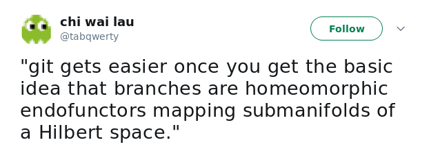
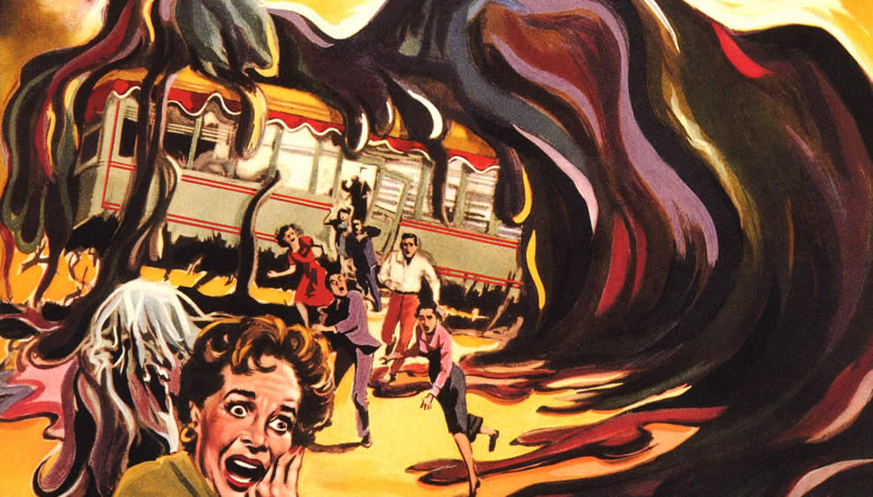
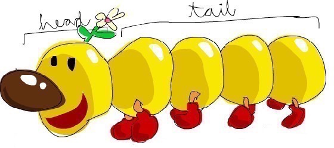

# Think like git
## by Olgierd &#34;Allgreed&#34; Kasprowicz


## Foreword





## Let's git to it! From scratch!

- <span class="fragment fade-up" data-fragment-index="1">DVCS</span>
- <span class="fragment fade-up" data-fragment-index="2">Version control system</span><span class="fragment fade-up" style="color:#b58900" data-fragment-index="7"> + network = ↑</span>
- <span class="fragment fade-up" data-fragment-index="3">Stupid content tracker</span><span class="fragment fade-up" style="color:#b58900" data-fragment-index="6"> + branches & tags = ↑</span>
- <span class="fragment fade-up" data-fragment-index="4">Persistent map</span><span class="fragment fade-up" style="color:#b58900" data-fragment-index="5"> + trees & commits = ↑</span>


# Persistent map


### A map?


### Implementation

- Keys: SHA1 of the content<br>
- Values: the content

<br>

``` bash
$ echo "elorap" | git hash-object --stdin
```
<!-- .element: class="fragment fade-up" -->

```
2511755d6bfe6afb0462cc8ba7b254e371b7e191
```
<!-- .element: class="fragment fade-up" -->


### Details

<br>

``` bash
$ echo "elorap" | git hash-object --stdin
2511755d6bfe6afb0462cc8ba7b254e371b7e191
```

```bash
$ echo "elorap" | sha1sum -
```
<!-- .element: class="fragment fade-up" -->

```
8aec9bf5a852dbe30b3ebe9854be53feef471a5a  -
```
<!-- .element: class="fragment fade-up" -->

<br>
```
git_hash(content) = sha1("{type} {size_in_bytes}\0{content}")
```
<!-- .element: class="fragment fade-up" -->

```bash
echo -e "blob 7\0elorap" | sha1sum -
```
<!-- .element: class="fragment fade-up" -->

```
2511755d6bfe6afb0462cc8ba7b254e371b7e191  -
```
<!-- .element: class="fragment fade-up" -->


### Persistence

```
git init
```
<!-- .element: class="fragment fade-up" -->

#### Insert

```bash
echo "elorap" | git hash-object --stdin -w
```
<!-- .element: class="fragment fade-up" -->

```
2511755d6bfe6afb0462cc8ba7b254e371b7e191
```
<!-- .element: class="fragment fade-up" -->

#### Retrive

```
git cat-file -p 2511755d6bfe6afb0462cc8ba7b254e371b7e191
```
<!-- .element: class="fragment fade-up" -->

```
elorap
```
<!-- .element: class="fragment fade-up" -->


### Demo
```
mkdir -p /tmp/demos/persistent-map
cd $_
git init
echo "elorap" > whatever.txt
ranger .git

git hash-object whatever.txt -w
git cat-file -p 2511755d6bfe6afb0462cc8ba7b254e371b7e191
ranger .git
```


### typeof 2511755 ?
```
git cat-file -t 2511755d6bfe6afb0462cc8ba7b254e371b7e191
```
<!-- .element: class="fragment fade-up" data-fragment-index="1"-->
## Blob
<!-- .element: class="fragment fade-up" data-fragment-index="3"-->

<!-- .element: class="fragment fade-up" data-fragment-index="2"-->


## Wait a sec...
### We only add, but never delete...
<!-- .element: class="fragment fade-in" -->


# Stupid content tracker


### What we already know


### Demo
```
mkdir -p /tmp/demos/trees
cd $_
for i in {0..3}; do echo "test$i" > file$i.txt; done
ls
git init
for i in {0..3}; do git hash-object -w file$i.txt | head -c 7; echo; done
```
<!-- .element: style="width: 100%" -->


### What we already have


### What we want


### How directories group files?

```bash
.
├── file0.txt # "test0\n"
├── file1.txt # "test1\n"
├── file2.txt # "test2\n"
└── file3.txt # "test3\n"
```
<!-- .element: class="fragment fade-up" -->
<br>

```
[file / directory] [name]
```
<!-- .element: class="fragment fade-up" -->

```
file file0.txt
file file1.txt
file file2.txt
file file3.txt
```
<!-- .element: class="fragment fade-up" -->


### How _ group blobs?
```bash
38143ad
a5bce3f
180cf83
df6b0d2
```
<!-- .element: class="fragment fade-up" -->
<br>

```
[blob / _] [SHA1]
```
<!-- .element: class="fragment fade-up" -->

```
blob 38143ad
blob a5bce3f
blob 180cf83
blob df6b0d2
```
<!-- .element: class="fragment fade-up" -->


### Implementation

```
# in a git repository
git add .
git write-tree
```
<!-- .element: class="fragment fade-up" data-fragment-index="1"-->

```
f7c781e243742a9b392f5af7192b6b3e64940c9e
```
<!-- .element: class="fragment fade-up" data-fragment-index="2"-->
<br>
```
git cat-file -p f7c781e243742a9b392f5af7192b6b3e64940c9e
```
<!-- .element: class="fragment fade-up" data-fragment-index="3"-->
```
100644 blob 38143ad4a0fe2ab6ee53c2ef89a5d9e2bd9535da	file0.txt
100644 blob a5bce3fd2565d8f458555a0c6f42d0504a848bd5	file1.txt
100644 blob 180cf8328022becee9aaa2577a8f84ea2b9f3827	file2.txt
100644 blob df6b0d2bcc76e6ec0fca20c227104a4f28bac41b	file3.txt
```
<!-- .element: class="fragment fade-up" data-fragment-index="3"-->

```
[mode] [type] [SHA1] [name in FS]
```
<!-- .element: class="fragment fade-up" data-fragment-index="4"-->


### typeof f7c781e ?

```
git cat-file -t f7c781e243742a9b392f5af7192b6b3e64940c9e
```


<!-- .element: class="fragment fade-up" data-fragment-index="2" -->


### Let's change something

```
git hash-object file0.txt
```
```
38143ad4a0fe2ab6ee53c2ef89a5d9e2bd9535da
```

```
echo "made some changes" >> file0.txt
git hash-object file0.txt
```
<!-- .element: class="fragment fade-up" data-fragment-index="1"-->

```
fed3ffb24afa4fd86ffe990fc14c13b058b40f74
```
<!-- .element: class="fragment fade-up" data-fragment-index="1"-->
<br>

```
git add file0.txt
git write-tree
```
<!-- .element: class="fragment fade-up" data-fragment-index="2"-->
```
00529ea520638e2148faab1ab0ede2208577bb74
```
<!-- .element: class="fragment fade-up" data-fragment-index="2"-->


```
git cat-file -p f7c781e243742a9b392f5af7192b6b3e64940c9e
```
<pre><code class="nohighlight" style="background: #3f3f3f" data-noescape><span class="fragment highlight-blue" data-fragment-index="1">100644 blob</span> <span class="fragment highlight-red" data-fragment-index="1">38143ad4a0fe2ab6ee53c2ef89a5d9e2bd9535da</span><span class="fragment highlight-blue" data-fragment-index="1">	file0.txt</span>
<span class="fragment highlight-blue" data-fragment-index="1">100644 blob a5bce3fd2565d8f458555a0c6f42d0504a848bd5	file1.txt
100644 blob 180cf8328022becee9aaa2577a8f84ea2b9f3827	file2.txt
100644 blob df6b0d2bcc76e6ec0fca20c227104a4f28bac41b	file3.txt</span></code></pre>

```
git cat-file -p 00529ea520638e2148faab1ab0ede2208577bb74
```

<pre><code class="nohighlight" style="background: #3f3f3f" data-noescape><span class="fragment highlight-blue" data-fragment-index="1">100644 blob</span><span class="fragment highlight-green" data-fragment-index="1"> fed3ffb24afa4fd86ffe990fc14c13b058b40f74</span><span class="fragment highlight-blue" data-fragment-index="1">	file0.txt</span>
<span class="fragment highlight-blue" data-fragment-index="1">100644 blob a5bce3fd2565d8f458555a0c6f42d0504a848bd5	file1.txt
100644 blob 180cf8328022becee9aaa2577a8f84ea2b9f3827	file2.txt
100644 blob df6b0d2bcc76e6ec0fca20c227104a4f28bac41b	file3.txt</span>
</code></pre>


### The graph (again)

<!-- .slide: data-transition="fade" -->


### The graph (again)
<!-- .slide: data-transition="fade" -->


### The change 
```bash
f7c781e # state 0 - before "some changes"
00529ea # state 1 - after "some changes"
```

<div>
Given a <span class="fragment highlight-blue" data-fragment-index="2">single</span> identifier:
<ul>
<li><span class="fragment highlight-green" data-fragment-index="3">What is the current state?</span></li>
<li><span class="fragment highlight-red" data-fragment-index="4">How it was before?</li>
<li><span class="fragment highlight-red" data-fragment-index="5">When did it change?</li>
<li><span class="fragment highlight-red" data-fragment-index="6">By whom?</li>
<li><span class="fragment highlight-red" data-fragment-index="7">Why?</li>
</ul>
<!-- .element: class="fragment fade-up" data-fragment-index="1"-->


### Implementation
## A commit

```bash
# in an empty git repo

... # do some stuff
git add .
git commit -m "Initial commit"
```
<!-- .element: class="fragment fade-up" data-fragment-index="1"-->

```bash
# caution! hashes may vary
f0c690a67d846529202c75691ef725e8a584440f
```
<!-- .element: class="fragment fade-up" data-fragment-index="2"-->

```
...
git add .
git commit -m "Made changes"
```
<!-- .element: class="fragment fade-up" data-fragment-index="3"-->

```bash
# caution! hashes may vary
6291a11c4a94b59c5737009ad0c965cab855736b
```
<!-- .element: class="fragment fade-up" data-fragment-index="4"-->


### The change revisited
```
git cat-file -p 6291a11c4a94b59c5737009ad0c965cab855736b
```
<!-- .element style="width: 110%" -->
<pre style="width: 110%"><code class="nohighlight" style="background: #3f3f3f" data-noescape><span class="fragment highlight-current-blue" data-fragment-index="1">tree 00529ea520638e2148faab1ab0ede2208577bb74</span>
<span class="fragment highlight-current-blue" data-fragment-index="2">parent f0c690a67d846529202c75691ef725e8a584440f</span>
<span class="fragment highlight-current-blue" data-fragment-index="4">author Olgierd "Allgreed" Kasprowicz &lt;olixem@gmail.com&gt;</span> <span class="fragment highlight-current-blue" data-fragment-index="3">1534465200 +0200</span>
<span class="fragment highlight-current-blue" data-fragment-index="4">committer Olgierd "Allgreed" Kasprowicz &lt;olixem@gmail.com&gt;</span> <span class="fragment highlight-current-blue" data-fragment-index="3">1534465200 +0200</span>

<span class="fragment highlight-current-blue" data-fragment-index="5">Made changes</span></code></pre>

<ul>
<li><span class="fragment highlight-green" data-fragment-index="1">What is the current state?</span></li>
<li><span class="fragment highlight-green" data-fragment-index="2">How it was before?</li>
<li><span class="fragment highlight-green" data-fragment-index="3">When did it change?</li>
<li><span class="fragment highlight-green" data-fragment-index="4">By whom?</li>
<li><span class="fragment highlight-green" data-fragment-index="5">Why?</li>
</ul>


# Revision control system


### What we already know


### What we want
- Reviewing particular version
- Marking special points in time
- Separating groups of changes


### Before we begin


### Reviewing particular version


### Implementation


### HEAD?


<b style="text-decoration: underline">Unique per repo</b>, mutable pointer to [ **commit** | **_** ]<br>


### Demo
```
mkdir -p /tmp/demos/head-commit
cd $_
git init

echo "This is no. 0 version of this file" > whatever.txt
git add --all
git commit -m "Version 0"

echo "This is no. 1 version of this file" > whatever.txt
git add --all
git commit -m "Version 1"

ST_COMMIT_HASH=`git log --oneline --no-abbrev | tail -n 1 | cut -f 1 -d' '`
ND_COMMIT_HASH=`git log --oneline --no-abbrev | head -n 1 | cut -f 1 -d' '`
```
<!-- .element style="width: 110%" -->


```
$ echo First commit: $ST_COMMIT_HASH
First commit: bd43d4bc170eb2186cbecdcd1940c16f1b5abf44

$ echo Second commit: $ND_COMMIT_HASH
Second commit: 17b80d31a198622d9b4dd7bbdea98a72f137947b
```

```
$ git log
commit 17b80d31a198622d9b4dd7bbdea98a72f137947b
Author: Olgierd "Allgreed" Kasprowicz <olixem@gmail.com>
Date:   Wed Sep 26 13:40:55 2018 +0200

    Version 1

commit bd43d4bc170eb2186cbecdcd1940c16f1b5abf44
Author: Olgierd "Allgreed" Kasprowicz <olixem@gmail.com>
Date:   Wed Sep 26 13:40:55 2018 +0200

    Version 0
```
<!-- .element: class="fragment fade-up" -->


```
$ git checkout $ST_COMMIT_HASH
...
$ cat whatever.txt
This is no. 0 version of this file
$ cat .git/HEAD
bd43d4bc170eb2186cbecdcd1940c16f1b5abf44
```
```
$ git checkout $ND_COMMIT_HASH
...
$ cat whatever.txt
This is no. 1 version of this file
$ cat .git/HEAD
17b80d31a198622d9b4dd7bbdea98a72f137947b
```
<!-- .element: class="fragment fade-up" -->


### Marking special points in time


### Tag

```
mkdir -p /tmp/demos/tag
cd $_
echo "Marshall Mathers" > rappers.txt
git init
git add --all
git commit -m "Add Eminem"
COMMIT_HASH=`git log --oneline | cut -f 1 -d' '`
```

```
git show $COMMIT_HASH
```
<!-- .element: class="fragment fade-up" -->

```
commit aa2b897b78cfa402a19e7b679780f7fe57ac0e3f
...
```
<!-- .element: class="fragment fade-up" -->

```
git tag slim-shady $COMMIT_HASH
```
<!-- .element: class="fragment fade-up" -->

```
git show slim-shady
```
<!-- .element: class="fragment fade-up" -->

```
commit aa2b897b78cfa402a19e7b679780f7fe57ac0e3f
...
```
<!-- .element: class="fragment fade-up" -->


### Separating groups of changes


<!-- .element: class="fragment fade-in" -->


<!-- .element: class="fragment fade-in" -->


### Demo
```
mkdir -p /tmp/demos/branches
cd $_
git init

echo "something" > whatever.txt
git add --all
git commit -m "Initial commit"
```
<!-- .element style="width: 110%" -->
```
git checkout -b bar-branch

echo "bar" > bar
git add --all
git commit -m "bar"
BAR_COMMIT=`git log --oneline --no-abbrev | head -n 1 | cut -f 1 -d' '`
```
<!-- .element style="width: 110%" class="fragment fade-up"-->
```
git checkout master

echo "foo" > foo
git add --all
git commit -m "foo"
FOO_COMMIT=`git log --oneline --no-abbrev | head -n 1 | cut -f 1 -d' '`
```
<!-- .element style="width: 110%" class="fragment fade-up"-->


```
$ git cat-file -p $BAR_COMMIT
```
<!-- .element style="width: 110%" -->

<pre style="width: 110%" class="fragment fade-up" data-fragment-index="1"><code class="nohighlight" style="background: #3f3f3f; color: #dcdcdc;" data-noescape>tree de34bcdcdd2424f0f8ba924700add216dddcefba
<span class="fragment highlight-current-blue" data-fragment-index="4">parent 32cb4bf58f8656e511812ccfe07eb6f87fb1c4f7</span>
author Olgierd "Allgreed" Kasprowicz <olixem@gmail.com> 1537973062 +0200
committer Olgierd "Allgreed" Kasprowicz <olixem@gmail.com> 1537973062 +0200

bar</code></pre>

```
$ git cat-file -p $FOO_COMMIT
```
<!-- .element style="width: 110%" class="fragment fade-up" data-fragment-index="2"-->

<pre style="width: 110%" class="fragment fade-up" data-fragment-index="3"><code class="nohighlight" style="background: #3f3f3f; color: #dcdcdc;" data-noescape>tree a1b176da0a03e655e9c03d864494d13d016672f9
<span class="fragment highlight-current-blue" data-fragment-index="4">parent 32cb4bf58f8656e511812ccfe07eb6f87fb1c4f7</span>
author Olgierd "Allgreed" Kasprowicz <olixem@gmail.com> 1537973067 +0200
committer Olgierd "Allgreed" Kasprowicz <olixem@gmail.com> 1537973067 +0200

foo</code></pre>


### Refs
ref = [ branch | tag ]

- **Tag**: Constant pointer to a commit
- **Branch**: Mutable pointer to a commit


### HEAD (again)

Unique per repo, mutable pointer to [ **commit** | **ref** ]<br>


### Demo
```
mkdir -p /tmp/demos/refs
cd $_
git init
echo "whatever" > really
git add --all
git commit -m "Initial commit"
COMMIT_HASH=`git log --oneline | cut -f 1 -d' '`
git tag my-tag $COMMIT_HASH
ranger .git
```


## Detached HEAD


HEAD not attached to any ref


### I said garbage collection before, right?


### Separating groups of changes
<!--
### Merges

- **Merge**: integrating changes between branches
- **Fast-forward merge**: Merging without a merge commit

### Rebases
-->


# DVCS


### What we already know


### What we want


### Distributed vs Decentralized ?


### Unit of distribution


### Making connections


|  Name  	|                    URL                    	|
|:------:	|:-----------------------------------------:	|
|  mike  	|  git@example.com:mike/sample-project.git  	|
| sylvia 	| git@example.com:sylvia/sample-project.git 	|


### Demo

```
mkdir -p /tmp/demos/remotes
cd $_
git clone https://github.com/allgreed/presentation-git
cd presentation-git
cat .git/config
```

<pre class="fragment fade-up" data-fragment-index="3"><code class="nohighlight" style="background: #3f3f3f; color: #dcdcdc;" data-noescape>[core]
	repositoryformatversion = 0
	filemode = true
	bare = false
	logallrefupdates = true
<span class="fragment highlight-current-blue" data-fragment-index="4">[remote "origin"]
	url = https://github.com/allgreed/presentation-git
	fetch = +refs/heads/*:refs/remotes/origin/*
</span>
[branch "master"]
	remote = origin
	merge = refs/heads/master</code></pre>


Sync:
- "Just-copy-missing" for objects
- Namespace refs


### Off-line
- Remote references are stored locally just like local branches
- `.git/refs/remotes/[remote]/*`


### Equal clones
- All repos made equal (technically) - clones
- Repo has [eventually consistent] information about every remote


### 4th type - Annotated Tag


### Blockchain?

> Blockchain - a growing list of records, called <b>blocks</b>, which are linked using cryptography.<br>~ [Wiki](https://en.wikipedia.org/wiki/Blockchain)

<br>
> Git - a growing list of records, called <b>commits</b>, which are linked using cryptography.
- `packed-refs`


- [Back to main presentation](/#/2)

## Sources

- [Paolo Perrotta - How Git Works? (Pluralsight)](https://app.pluralsight.com/library/courses/how-git-works/)
- [Meme](https://twitter.com/agnoster/status/44636629423497217)
- [About git hashes](https://stackoverflow.com/questions/552659/how-to-assign-a-git-sha1s-to-a-file-without-git)
- [More about git hashes](https://stackoverflow.com/questions/7225313/how-does-git-compute-file-hashes)
- [More about git trees](https://stackoverflow.com/questions/14790681/what-is-the-internal-format-of-a-git-tree-object)
