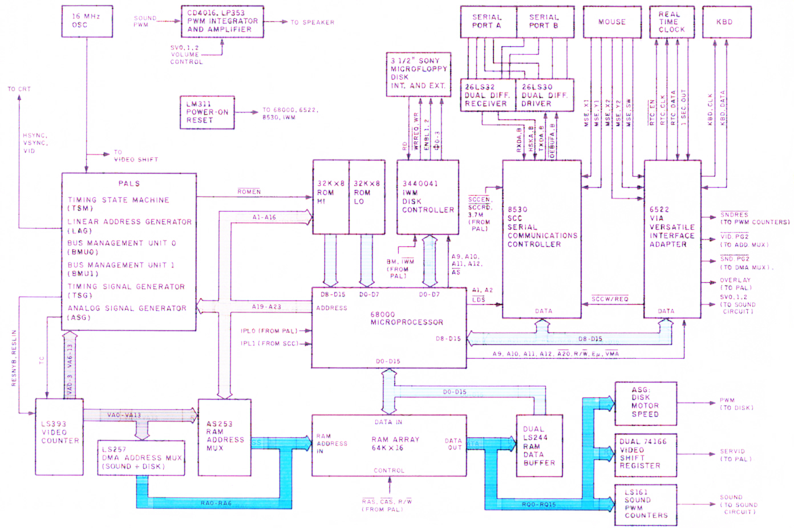
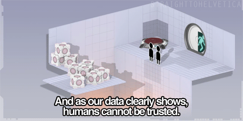

# What is <s>love</s> version control?
## by Olgierd &#34;Allgreed&#34; Kasprowicz

> <b>Version control system</b> - system that manages different versions of digital content  
> Me

<!-- .element class="fragment fade-up" data-fragment-index="1" -->

> <b>System</b> - regularly interacting or interdependent group of units forming an integrated whole  
> [Wikipedia/system](https://en.wikipedia.org/wiki/System)

<!-- .element class="fragment fade-up" data-fragment-index="2"-->

- simple system
- single version
- single unit of content

 

## Problem?
 
<!-- .element class="fragment fade-up" -->

## Solution

# Why ???

 

## Solution

## Wait, really?
<!-- .element class="fragment fade-up" -->

## Have you ever wanted to:
<ul>
    <li style="margin: 0.5em 0">see the difference between two (or more) versions of your code?</li>
    <li style="margin: 0.5em 0">check if a particular change broke or fixed a piece of code?</li>
    <li style="margin: 0.5em 0">review the history of some code?</li>
    <li style="margin: 0.5em 0">revert back a change, you've just mistakenly made?</li>
    <li style="margin: 0.5em 0">experiment with a new feature without interfering with working code?</li>
</ul>

## What is version?

<!-- .slide: data-transition="fade" -->

## What is version?

<!-- .slide: data-transition="fade" -->

## Colaboration!

## What is version? (again)

<!-- .slide: data-transition="fade" -->

## What is version? (again)

<!-- .slide: data-transition="fade" -->

## Let's automate version creation!

## public static void - enterprise audit

## Local / centralized / distributed

- [Back to main presentation](/#/2)

## Sources

[Why use VCS alone](https://stackoverflow.com/a/1408464/9134286)
https://en.wikipedia.org/wiki/Version_control
https://git-scm.com/book/en/v2/Getting-Started-About-Version-Control

